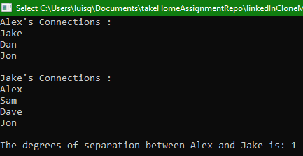

# LinkedInClassModel
Take home assignment, using OOP to create a class that allows to store information about a user, and allow the user to add connections to other users.

Every Instantiated object has three properties, userName, userProfilePicture (or the url of the user's picture), and the location of a user.
Every user has a unique UserID. This Id is very important when we wish to find which user is connected to which other user in the network.
Lastly, to find the degrees of separation (number of edges separating the two users in a network, i.e., graph), we will use DFS to determine if 
there is a connection, whether directly or indirectly between the two users, as we are traversing to other users in the network, we keep count of the
number of edges we traversed to reach the target user. If not connection could be made between two users in a network either directly (meaning they're connected), 
or indirectly (meaning they're connected through mutual connections) then we return -1 to denote a connection is not establish between the two users.

## Thank you
This was a fun project, I used C++ as the programming language for this assignment, since I've been using C++ quite a lot lately for coding interviews and interview prep.

### Portrait View of Website DoomsNay
  
