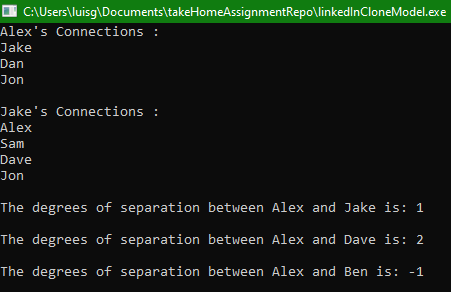

# LinkedInClassModel
Take home assignment, using OOP to create a class that allows to store information about a user, and allow the user to add connections to other users.

### Portrait View of Website DoomsNay
  
